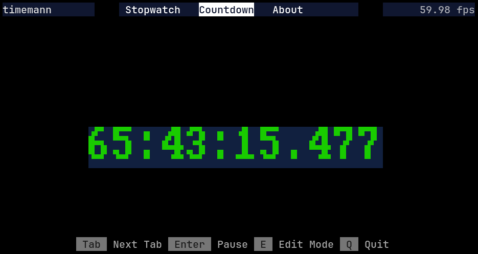

# timemann

A simple stopwatch and countdown timer app written in Rust using [Ratatui](https://ratatui.netlify.app/). The initial template was sourced from [this location](https://github.com/ratatui-org/ratatui-website/tree/main/code/ratatui-stopwatch-app), and the logic was adapted from [here](https://www.online-stopwatch.com/full-screen-stopwatch/).




## Installation

Install by compiling the source code.

```bash
  git clone https://github.com/figo711/timemann.git
  cd timemann
  cargo run --release
```

